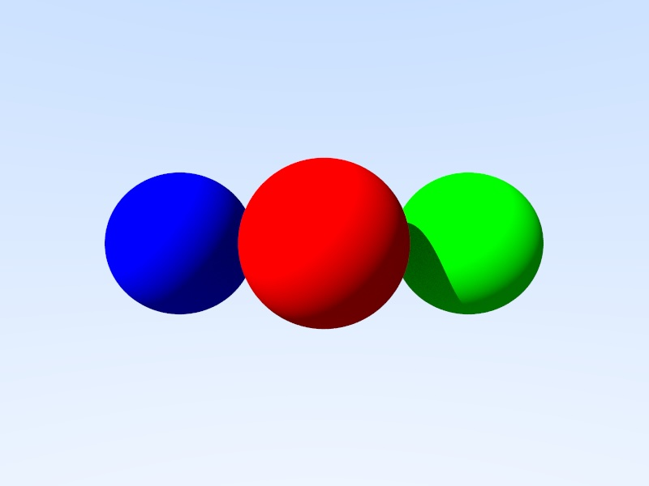

# rust-rasterizer
A rasterizer implementation in Rust

## To do:

- [X] Implement Sphere ray tracing
- [X] Implement Light structures and enhance ray_color function for direct and indirect lighting calculations
- [ ] Add more shapes (planes, triangles, meshes)
- [ ] Optimize performance using GPU acceleration
- [ ] Add texture mapping and material properties
- [ ] Implement shadows and reflections
- [ ] Create a user interface for scene setup and rendering options
- [ ] Write documentation and usage examples
