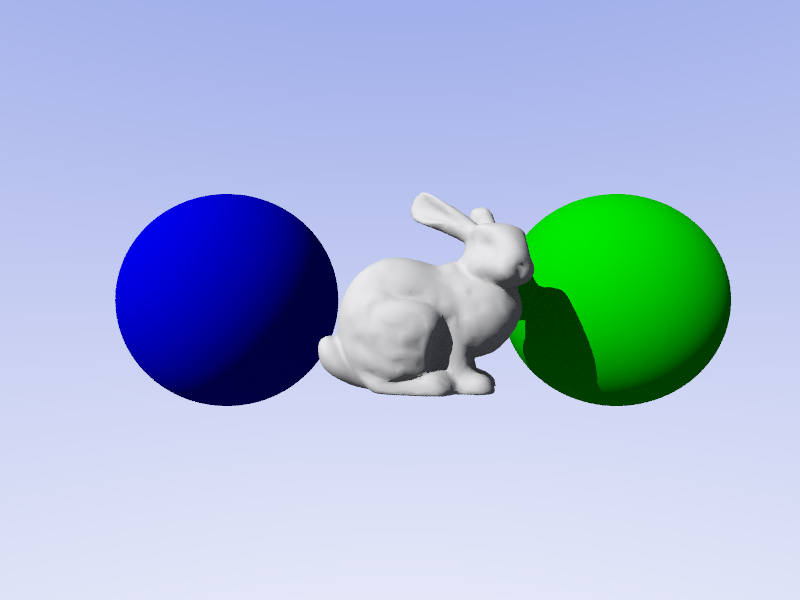

# Rust Raytracer

> A high-performance path tracing renderer with CPU, GPU, and real-time interactive implementations



## 🚀 Quick Start

**Try it online:** [Live WebGPU Raytracer](https://tchauffi.github.io/rust-rasterizer/)

**Run locally:**
```bash
git clone https://github.com/tchauffi/rust-rasterizer.git
cd rust-rasterizer
cargo run --bin live_raytracer --release
```

Use your mouse to rotate the camera and press `SPACE` to toggle rendering modes!

## ✨ What is this?

This project demonstrates three different approaches to ray tracing - a rendering technique that simulates how light behaves in the real world to create photorealistic images:

1. **🖥️ CPU Raytracer** - Traditional software rendering with full path tracing
2. **⚡ GPU Raytracer** - Hardware-accelerated offline rendering using compute shaders
3. **🎮 Live GPU Raytracer** - Real-time interactive raytracer you can navigate and explore

Whether you're learning about ray tracing, exploring Rust graphics programming, or looking for a starting point for your own renderer, this project provides working examples of multiple rendering approaches.

## 🎯 Key Features

- **Multiple Rendering Backends**: Choose between CPU, offline GPU, or real-time GPU rendering
- **Path Tracing**: Physically-based lighting with multiple light bounces for realistic illumination
- **Mesh Support**: Load and render complex .obj models with triangle meshes
- **HDR Environment Maps**: Support for high dynamic range .exr skyboxes
- **Interactive Controls**: Real-time camera navigation with mouse controls
- **WebAssembly Support**: Runs in the browser using WebGPU
- **Multiple Materials**: Diffuse, metallic surface properties
- **Acceleration Structures**: BVH for efficient ray-mesh intersection
- **Progressive Rendering**: Denoising and sample accumulation for high-quality images

## 📦 Installation & Usage

### 🖥️ CPU Raytracer (Software Rendering)

The CPU version renders scenes using traditional CPU-based raytracing and outputs to a PPM image file. Best for learning how raytracing works under the hood.

```bash
# Build and run (outputs to stdout, redirect to file)
cargo run --release > output.ppm

# Or build first, then run
cargo build --release
./target/release/rust-raytracer > output.ppm
```

**Use this when:**

- Learning raytracing fundamentals
- Debugging rendering algorithms
- No GPU compute support available

**Features:**

- Full path tracing with multiple bounces
- Direct and indirect lighting
- Mesh support (.obj files)
- Sphere primitives

### ⚡ GPU Raytracer (Offline Rendering)

The GPU version uses compute shaders to accelerate rendering, outputting to a PPM file. Significantly faster than CPU rendering for high-quality images.

```bash
# Build and run
cargo run --bin gpu_raytracer --release > output.ppm

# Or build separately
cargo build --bin gpu_raytracer --release
./target/release/gpu_raytracer > output.ppm
```

**Use this when:**

- Rendering high-quality final images
- Need faster rendering than CPU
- Don't need real-time interaction

**Features:**

- GPU-accelerated compute shader rendering
- Same scene quality as CPU version
- Significantly faster rendering times (10-100x speedup)
- Hardware-accelerated ray-triangle intersection

### 🎮 Live GPU Raytracer (Interactive Real-time)

The live version provides a real-time interactive window where you can navigate the scene. Perfect for exploring scenes and iterating on designs.

```bash
# Run the live raytracer
cargo run --bin live_raytracer --release
```

**Use this when:**

- Exploring and navigating scenes interactively
- Setting up camera angles for final renders
- Demonstrating raytracing in real-time
- Debugging scene geometry

**Controls:**

- **Mouse**: Click and drag to rotate the camera
- **SPACE**: Toggle between raytracing and normals visualization modes
- **Window Title**: Displays current mode and FPS

**Features:**

- Real-time GPU raytracing (30-60 FPS on modern GPUs)
- Interactive camera controls
- Two rendering modes:
  - **Raytracing**: Full path tracing with lighting and shadows
  - **Normals**: Fast visualization showing surface normals (useful for debugging)
- Live FPS counter in window title
- WebAssembly support for browser-based rendering

## 🛠️ Requirements

- **Rust**: Latest stable version (install from [rustup.rs](https://rustup.rs/))
- **GPU versions**: A GPU with compute shader support
  - Vulkan (Linux, Windows, Android)
  - Metal (macOS, iOS)
  - DirectX 12 (Windows)
- **Web version**: A browser with WebGPU support (Chrome 113+, Edge 113+, Firefox with flag)

## 🌐 Web Deployment

The project can be built for WebAssembly and deployed to GitHub Pages:

```bash
# Install trunk (if not already installed)
cargo install trunk

# Build for web
trunk build --release

# The output will be in the dist/ directory
```

## ⚙️ Performance

Performance varies based on hardware and scene complexity:

| Renderer | Resolution | FPS/Time | Notes |
|----------|-----------|----------|-------|
| CPU | 1920x1080 | ~30-60s | Single-threaded, full quality |
| GPU Offline | 1920x1080 | ~3-5s | High-quality final render |
| GPU Live | 800x600 | 30-60 FPS | Real-time, interactive |
| WebGPU | 800x600 | 25-50 FPS | 15-20% slower than native |

> **Note**: Benchmarks are approximate and measured on modern hardware (M1/M2 Mac or RTX 3000+ series GPU). Your results may vary.

## 📋 Roadmap

**Completed:**

- [X] Sphere ray tracing
- [X] Direct and indirect lighting calculations
- [X] Triangle meshes and .obj loading
- [X] GPU acceleration with compute shaders
- [X] Shadows and reflections
- [X] Interactive real-time viewer
- [X] WebAssembly/WebGPU support
- [X] BVH acceleration structure for faster ray-mesh
- [X] Progressive rendering with denoising

**Planned:**

intersection
- [ ] Texture mapping (UV coordinates and image textures)
- [ ] Additional material types (glass, subsurface scattering)
- [ ] Scene file format for easy scene definition
- [ ] Camera controls (zoom, pan, dolly)

## 🙏 Acknowledgments

Built with Rust and powered by:

- [wgpu](https://wgpu.rs/) - Cross-platform graphics API
- [egui](https://www.egui.rs/) - Immediate mode GUI
- [trunk](https://trunkrs.dev/) - WASM web bundler

---

**Made with ❤️ by [tchauffi](https://github.com/tchauffi)**

Star ⭐ this repository if you find it helpful!
